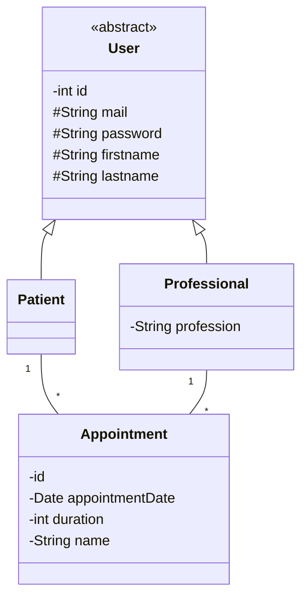

# Projet pour le TP JPA 2021 UniR

```mermaid
    classDiagram
    User <|-- Professional
    User <|-- Patient
    Patient "1" --  "*"Appointment
    Professional "1" --  "*"Appointment
    
    class User{
        <<abstract>>
        -int id
        #String mail
        #String password
        #String firstname
        #String lastname
    }
    
    class Professional{
        -String profession
    }
    
    class Appointment{
        -id
        -Date appointmentDate
        -int duration
        -String name
    }
```

