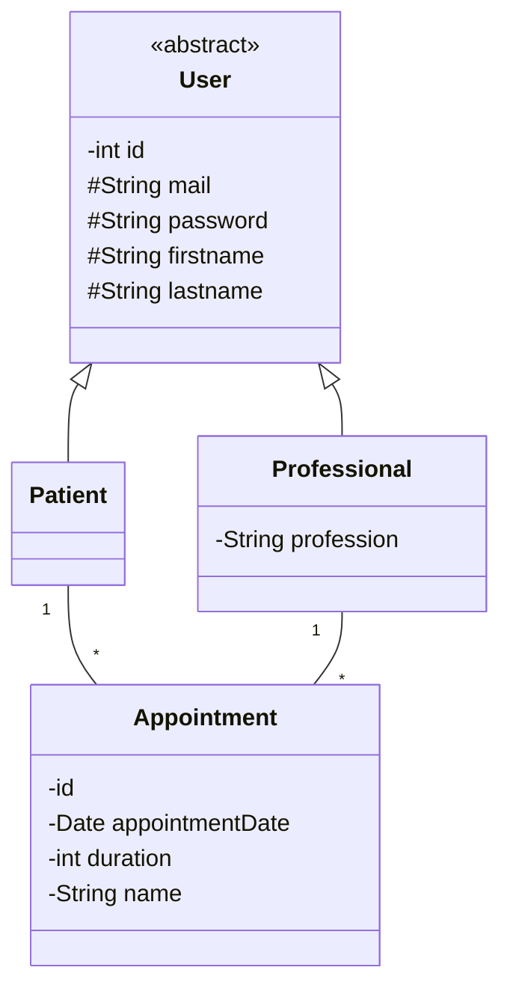

# Projet pour le TP JPA 2021 UniR

## Pour lancer le projet

Pour lancer le projet il faut : 
- Lancer le serveur hsql
- Lancer le JpaTest.java pour peupler la bdd

Réalisation dans le projet :
- [x] Classe métier
- [x] Classes DAO
- [x] Annotations pour éviter les contraintes de cycles
- [x] Rest ressources pour l'API
- [x] Implémentation OPEN API
- [x] Implémentation d'un Swagger

Vous trouverez ci-dessous un digramme de classe pour décrire le modèle métier.

