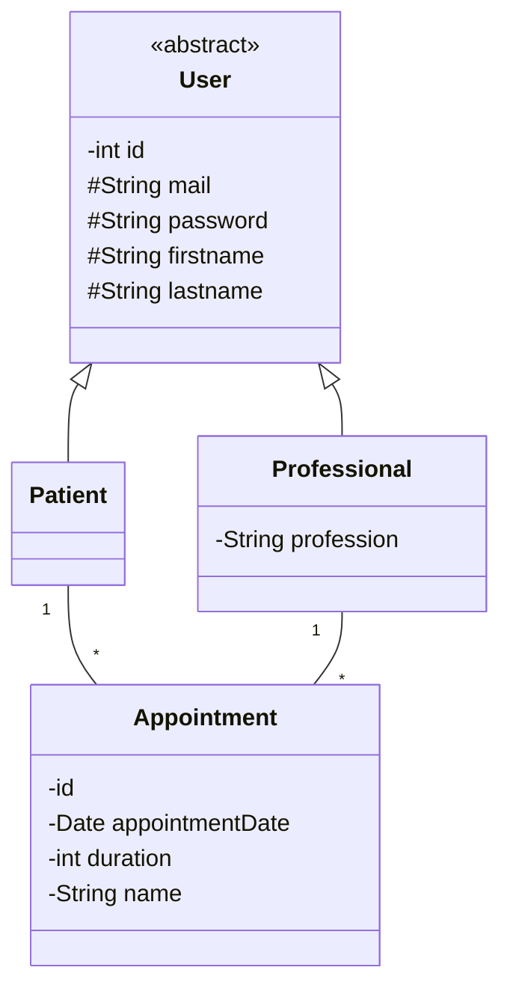

# Projet pour le TP JPA 2021 UniR

## Pour lancer le projet

Pour lancer le projet il faut :
- Lancer le serveur hsql
- Lancer le JpaTest.java pour peupler la bdd (dans le cas du tp JPA)
- Lancer le test.script dans le répertoire data (dans le cas de spring)
- Lancer le serveur REST

Les credentials du serveur sont ceux de base du TP JPA :

url=jdbc:hsqldb:hsql://localhost/

username=sa

password=

## Organisation du git

Ce git rassemble tout les tp du module TAA. Les différents jalons du TP sont dans 
les différentes branches.
- TP1 est la branche pour le TP1 (partie jpa/JaxRS)
- master est la branche du TP2 (branche finale jpa/JaxRS)
- TP3_Spring contient la branche du TP3 (partie JPA/Spring)
- TP4_Spring contient la branche du TP4 (partie finale JPA/Spring)

Pour la partie spring, un fichier export de collection d'insomnia /tests/TAA-tests.json est disponible
pour tester l'API.

Les branches les plus importantes sont la branche master et TP4_Spring car elles contiennent la
version finale du tp (jaxRS,jpa et JPA,Spring)

# Mon avancement

Mon modèle métier est similaire entre le projet jpa/jaxRS et Spring. Je pense avoir utilisé au moins une 
fois tous les aspects et technologies évoqués uniquement sur spring. En effet, ma partie JaxRs n'est pas 
complète. J'ai trouvé plus judicieux de me focaliser sur Spring car pour mon alternance j'utilise cette 
technologie et je ne l'avais jamais pratiqué avant.

## Modèle métier
Vous trouverez ci-dessous un digramme de classe pour décrire le modèle métier.

## Partie JPA/Jaxrs

Cette partie n'est pas complète mon alternance comportant une partie de spring/keycloack j'ai
préféré m'intéresser à la partie spring du TP.

### API

On peut upload, get des utilisateurs (patients ou professionnels) ainsi que des rendez-vous

L'API est moins complète que dans la partie Spring

### DTO

Je n'ai pas fait de DTO pour cette partie elle sera présente dans Spring

### AOP (Programmation par aspect)

Pas de programmation AOP dans la partie JPA/JaxRS.

### OpenAPI

Une description OpenApi est disponible et un swagger est mis en place pour l'api.
Des annotations swagger ne sont pas utilisés dans cette partie.

### Authentification

Il n'y a pas d'authentification pour cette partie

## Partie Spring

### API

On peut upload, update, delete, get des utilisateurs (patient ou professionnels) ainsi que des rendez-vous

Une collection Insomnia est mise à disposition pour tester les requêtes.

### DTO

On ne manipule pas directement les DAO présent dans le package "DAO". On passe par des DTO dans le 
package "DTO". Ces classes de DTO sont générées à l'aide de MapStruct.

### AOP (Programmation par aspect) 

Dans le package "aspect" il y a une classe de gestion de log pour les appels rest 
exécuté sur notre API.

### OpenAPI

Il y a un endpoint openAPI disponible avec un swagger :

OpenAPI : http://localhost:8082/v3/api-docs

Swagger : http://localhost:8082/swagger-ui/index.html#/

### Authentification

Une authentification keycloack a été mis en place.

Le keycloack tourne sur le port 8080. Voici les caractéristiques que j'ai configuré dans mon keycloack

- realm : myspringbootapp
- Roles : ADMIN et USER
- Users : username:admin password:admin et username:myuser password:myuser

Des requêtes insomnia ont été réalisées pour tester la récupération de token et l'accès aux pages.
L'utilisation d'insomnia et de ces requêtes devraient faciliter le test de l'application.

# Récapitulatif 

J'ai utilisé toutes les technologies évoquées dans les TP. Même si le tp jaxRS n'est pas 
entièrement fini, j'ai terminé tous ce qui n'a pas été fait en jaxRS dans la partie Spring.

